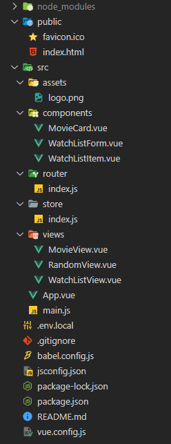
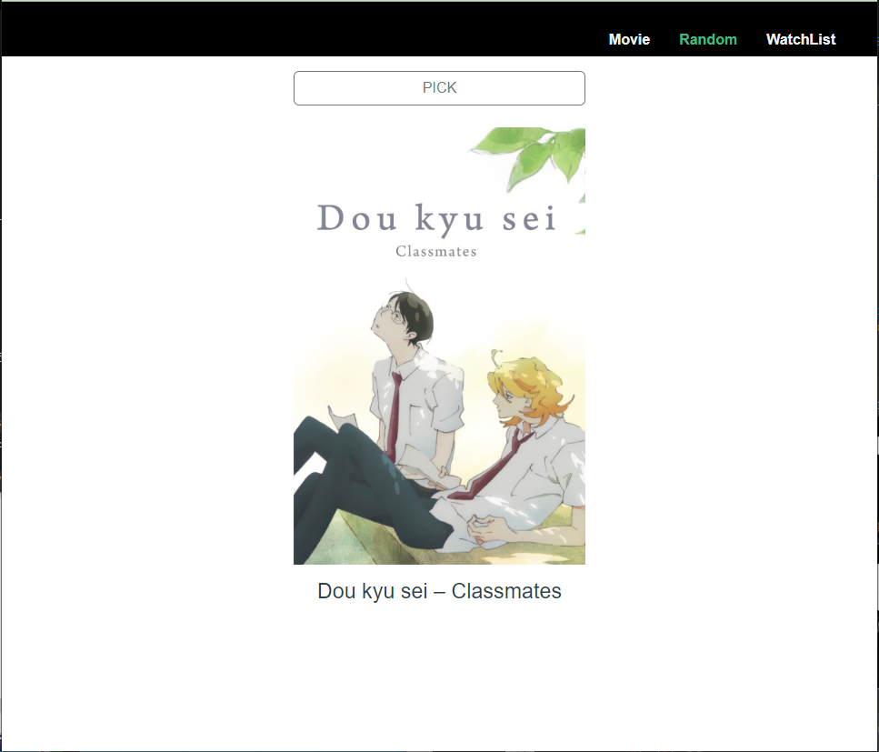

# # PJT 09

### 이번 pjt 를 통해 배운 내용

* vuex를 이용하여 데이터를 저장해놓고 불러오는 방법
* AJAX 통신과 JSON 구조에 대한 이해
* Vue CLI, Vue Router 활용


## A. 공통 요구사항

- 요구사항

  - .gitignore 파일을 추가하여 불필요한 파일 및 폴더는 제출하지 않도록 합니다. 
  - 명시된 요구사항 이외에는 자유롭게 작성해도 무관합니다. 
  - 요구사항 완성 후에 Bootstrap을 이용하여 자유롭게 스타일링 합니다. • Vuex 사용은 선택사항입니다.

- 결과 : 

  

  - `router`
  
  ```js
  import Vue from 'vue'
  import VueRouter from 'vue-router'
  import MovieView from '@/views/MovieView.vue'
  import RandomView from '@/views/RandomView.vue'
  import WatchListView from '@/views/WatchListView.vue'
  
  Vue.use(VueRouter)
  
  const routes = [
    {
      path: '/movies',
      name: 'movie',
      component: MovieView
    },
    {
      path: '/random',
      name: 'random',
      component: RandomView
    },
    {
      path: '/watch-list',
      name: 'watchlist',
      component: WatchListView
    }
    
  ]
  
  const router = new VueRouter({
    mode: 'history',
    base: process.env.BASE_URL,
    routes
  })
  
  export default router
  
  ```

  - `store`
  
  ```js
  import Vue from 'vue'
  import Vuex from 'vuex'
  import axios from 'axios'
  
  Vue.use(Vuex)
  
  export default new Vuex.Store({
    state: {
      topRanked : null,
      bucketMovies : [],
    },
    getters: {
    },
    mutations: {
      getTopMovies(state){
        axios.get('https://api.themoviedb.org/3/movie/top_rated?api_key=642cc263c19a3b2f7ab3f2c988a752ab&language=en-US&page=1')
        .then( result=>{
          console.log(result)
          console.log(result.data.results)
          state.topRanked=result.data.results
        })
      },
      addBucketMovies(state, Title){
        state.bucketMovies.push(Title)
        console.log(state.bucketMovies)
      }
    },
    actions: {
    },
    modules: {
    }
  })
  
  ```
  
  - 내가 생각하는 이 문제의 포인트
    - vuex 의 동작 과정을 이해하고 각각 목적에 맞는 요소를 활용하는 것이 중요하다.
    - 기본적인 router 사용 문법을 익힌다.
    - URL구조 생성

---


## B. 최고 평점 영화 출력

- 요구 사항 : 

  - 네비게이션 바에서 Movie 링크(/movies)를 클릭하면 AJAX 통신을 이용하여 TMDB API로 부터 JSON 데이터를 받아와 다음과 같이 영화 목록을 출력합니다

- 결과 : 

  ```vue
  <template>
      <div>
          <h1>MovieView</h1>
          <div class="row row-cols-1 row-cols-md-4
           g-4">
              <article v-for="(value, index) in topRanked" :key="index">
                  <MovieCard :movie-data="value" class="col"/>
              </article>
          </div>
      </div>
  </template>
  
  <script>
  import MovieCard from '@/components/MovieCard.vue';
  export default {
      name:'MovieView',
      data(){
          return {
          }
      },
      components:{
          MovieCard,
      },
      methods: {
      },
      computed:{
          topRanked(){
              return this.$store.state.topRanked
          }
      }
  }
  </script>
  ```
  
  - 내가 생각하는 이 문제의 포인트
    - 영화 목록을 처음에 한 번만 불러오는 것
    - 데이터를 가공하여 v-for로 props를 전달하는 것
    - computed로 store데이터를 연동시키는 것

---

....

## C. 최고 평점 영화 중 랜덤 영화 한 개 출력

- 요구 사항 : 

  - 네비게이션 바에서 Random 링크(/random)를 클릭하면 저장된 최고 평점 영화 목록 중 랜덤으로 한 개를 출력합니다

- 결과 : 

  

  ```vue
  <template>
      <div>
          <div class="d-grid gap-4 col-4 mx-auto">
              <button class="btn btn-outline-secondary" @click="getRandomMovie">PICK</button>
              <div v-if="movie" style="width: 100%;">
                  
                  <h4 style="margin:1rem;">{{ movie.title }}</h4>
              </div>          
          </div>
      </div>
  </template>
  
  <script>
  import _ from 'lodash'
  
  export default {
      name:'RandomView',
      data(){
      return {
        movie: "",
      }
      },
      methods: {
          getRandomMovie() {
              console.log(this.movie)
              this.movie = _.sample(this.$store.state.topRanked)
          }
      }
  }
  </script>
  
  <style>
  .btn {
    margin-top: 1rem;  
  }
  </style>
  ```

  - 내가 생각하는 이 문제의 포인트
    - lodash 모듈을 사용하여 랜덤으로 영화를 불러온다.
    - `v-if` 를 사용해서 버튼을 눌러서 movie 데이터가 생겼을 때만 화면에 출력하도록 한다. 

---


## D. 보고 싶은 영화 등록 및 삭제하기

- 요구 사항 :

  -  네비게이션 바에서 WatchList 링크(/watch-list)를 클릭하면 보고 싶은 영화 제목을 등록할 수 있는 Form이 출력됩니다. 
  -  등록된 영화 제목을 클릭하면 취소선이 그어집니다.

- 결과 : 

  

  ```vue
  <template>
      <div>
          <h1>Bogo Chiffon Movie</h1>
          <input type="text"  v-model="inputTitle" @keyup.enter="addMovie">
          <input type="submit" value="Add" @click="addMovie">
  
          <WatchListForm/>
          <WatchListItem v-for="(movie,index) in bucketMovieList"
          v-bind:key="index"
          :movie-title='movie'/>
      </div>
  </template>
  
  <script>
  import WatchListForm from '@/components/WatchListForm.vue';
  import WatchListItem from '@/components/WatchListItem.vue';
  export default {
      name:'WatchListView',
      data(){
          return{
              inputTitle:null,
          }
      },
      computed: {
          bucketMovieList(){
              return this.$store.state.bucketMovies
          }
      },
      components:{
          WatchListForm,
          WatchListItem,
      },
      methods:{
          addMovie(){
              if (this.inputTitle){
  
                  this.$store.commit('addBucketMovies',this.inputTitle)
                  this.inputTitle=null
              }
          },
      }
  }
  </script>
  ```
  
  - 이 문제에서 어려웠던점
  - 내가 생각하는 이 문제의 포인트
    - 부모 컴포넌트에서 반복문으로 받아온 내용을 사용하는 것

문제 푼 내용을 기반으로 적어주세요.


# 후기

* 도원 : 버스 너무 편하다
* 보경 : git을 사용하여 협업하는 방법이 어려워 branch를 구분해서 사용하지 못했다. 다음에는 branch를 활용하여 협업을 진행해보아야겠다. 그리고 vue를 써서 프로젝트를 진행하니 vanila JS로 하는 것 보다 훨씬 편했다.  다양한 모듈을 설치하고 사용하면서 각각 어떻게 import하여 쓰는지도 공부가 되었고, 전에는 어렵게 느껴졌던 axios 통신이 쉬워졌다는 것도 느꼈다. 
* 희제 : git을 사용하는 법이 어려웠다. 충돌 문제로 git reset --hard를 여러번 사용하다보니 branch의 필요성을 느꼈고, 더 공부를 해야겠다고 생각했다.
